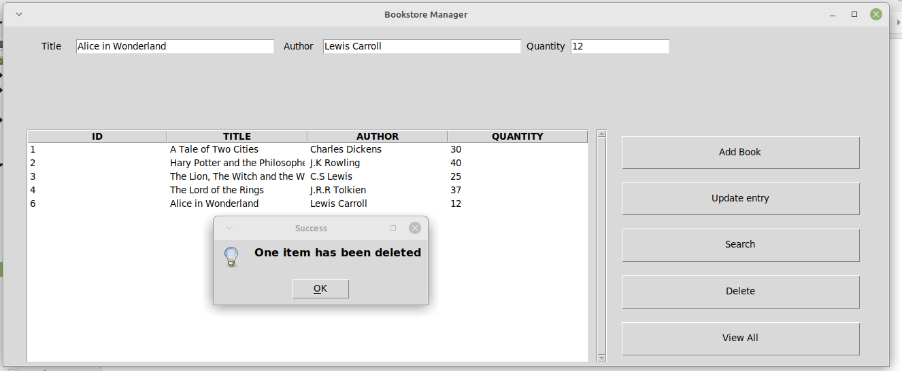
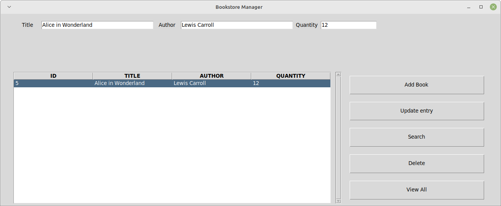
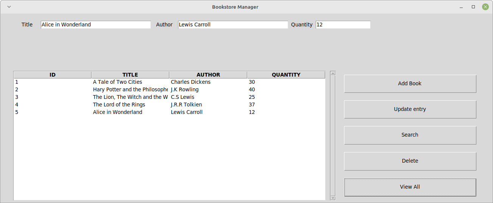

# Bookstore Manager with GUI

## Quick overview

This was one of my last bootcamp projects.
The program allows to easily manage a Bookstore database.
It is possible to view the whole catalogue, add, delete, update and search for a book.
The program comes with a GUI, coded in tkinter. I am aware that tkinter layout is quite old-fashioned and that there are modern and better looking ones. However, for this project, I decided to focus more on code quality and learning how to code a simple GUI.

## Installation

To run the program you just need to download [PYthon3](https://www.python.org/downloads/). 
An IDE to run Python code should be included by default (IDLE). 
If not I recommend [Visual Studio Codium](https://vscodium.com/).
Alternatively, you can click on the installer to launch the program without Python.

## Usage

Below are some screenshot of how the program works. 
It is very simple and intuitive to use:

 **Delete option**

 **Search option**

 **View all option**

